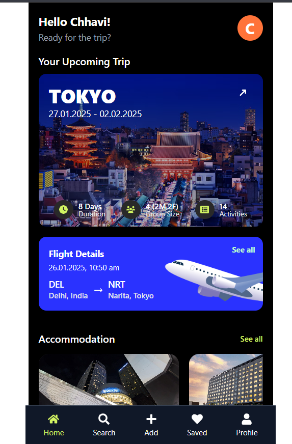
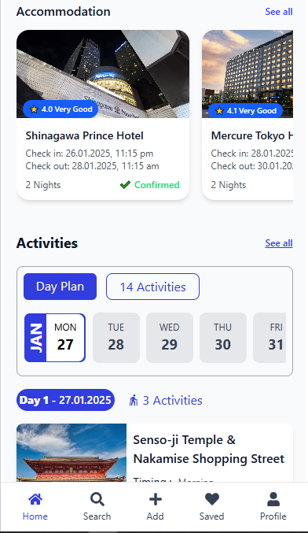
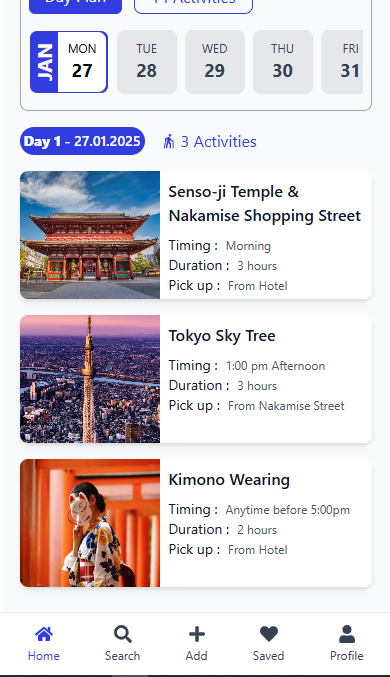
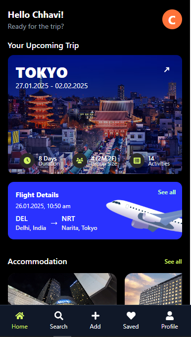
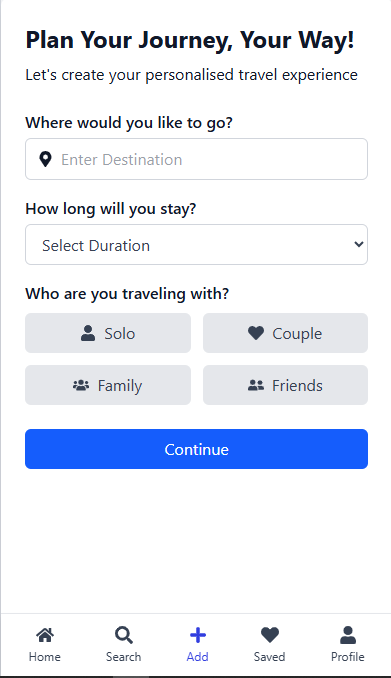
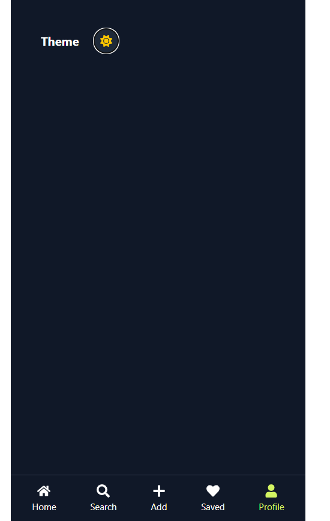

# 🌍 Travel Itinerary App

A **React-based travel itinerary application** that empowers users to seamlessly plan and manage their trips. Features include trip planning, activity scheduling, accommodation tracking, and a stylish dark/light theme toggle — all wrapped in a responsive, mobile-first design.

---

## ✨ Features

- 🏠 **Home Page** 
 View upcoming trips with flight, accommodation, and activity details.

 1. HomePage in Light Theme

 
 
 
 

 2. HomePage in Dark Theme
 
 
 

- 🧳 **Plan Trip** 
 Select your destination, travel dates, and companions with ease.

 1. Plan Trip page in Light Theme
 
 

 2. Plan Trip Page in Dark Theme

 

- 👤 **Profile Page** 
 Manage your preferences and switch between **Dark / Light Mode**.

- 📅 **Activity Tab** 
 Explore your day-by-day itinerary and activities.

- 📱 **Responsive Design** 
 Fully optimized for mobile, tablet, and desktop devices.

---

## 🛠️ Tech Stack

| Layer | Technologies |
|-------------|---------------------------------------------|
| **Frontend**| React, React Router, Tailwind CSS |
| **State** | Context API |
| **Styling** | Tailwind CSS + Custom Themes |
| **Carousel**| React Slick |
| **Icons** | React Icons |

---

## 📁 Project Structure

```bash
src/
├── 📂 assets/ # Static assets like images
├── 📂 components/ # Reusable UI components (e.g., Navbar, ActivityTab)
├── 📂 context/ # ThemeContext using Context API
├── 📂 layout/ # Shared layout components
├── 📂 pages/ # Route pages (Home, PlanTrip, Profile)
├── 📄 App.jsx # Main app component
├── 📄 main.jsx # App entry point
├── 📄 theme.css # Theme variables for dark/light modes
├── 📄 index.css # Global styles

```

## 🚀 Getting Started

### 1. Clone the Repository

```bash
git clone https://github.com/your-repo/travel-itinerary-app.git
cd travel-itinerary-app
````

### 2. Install Dependencies

```bash
npm install
```

### 3. Start the Development Server

```bash
npm run dev
```

### 4. Open the App

Visit: [http://localhost:5173](http://localhost:5173)

---

## 🔍 Folder Highlights

* 🧠 **Theme Management**
 Handled via `ThemeContext.jsx` using the Context API.

* 📆 **Dynamic Itinerary**
 Activities and dates dynamically rendered in `ActivityTab.jsx`.

* 🌗 **Dark / Light Mode**
 Theme variables defined in `theme.css` for styling toggles.

---

## 📦 Dependencies

* **React** – UI Library
* **React Router** – For client-side routing
* **Tailwind CSS** – Utility-first CSS framework
* **React Slick** – Carousel component
* **React Icons** – Icon library

---